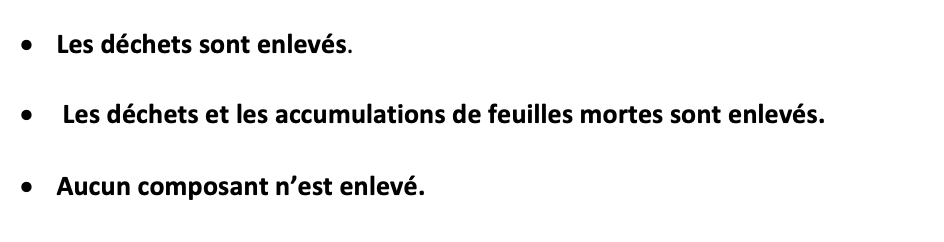
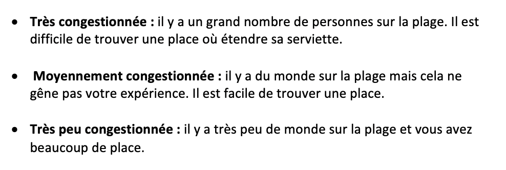
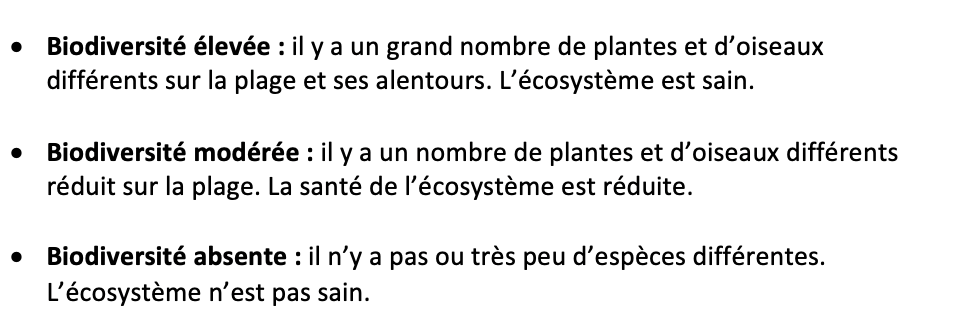
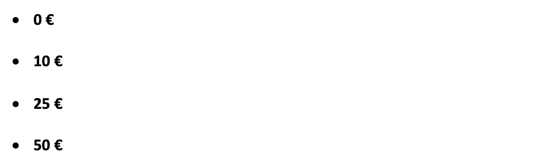

  <body>
    <h1>Introduction</h1>
    
Le but de cette recherche est de de comprendre la manière dont les résidents du sud de la France perçoivent la gestion des plages. Les informations que vous nous fournissez pourraient être utilisé pour influencer la manière dont les plages sont gérées. 

 
   
    
Merci de prendre le temps de lire les notes explicatives, elles vous seront utiles pour répondre au questionnaire.

<h1>Notes explicatives pour le questionnaire</h1>

Ce questionnaire a pour but d’identifier l’importance que les locaux portent pour la gestion des plages pour pouvoir en informer la municipalité. 

Sur les pages suivantes, nous vous demandons de choisir votre gestion de plage favorite entre plusieurs alternatives. Vous pouvez trouver ci-dessous toutes les informations sur les choix que vous devrez faire. 
 
 
 
 <h2>Qualité de l'eau</h2>
 
     
 Le mauvais traitement des eaux usées peut entrainer le développent de bactéries dans la mer. Ces bactéries peuvent poser des problèmes de santé tels que des otites ou des maux d’estomac. Les risques liés aux bactéries son généralement plus élevés pour les enfants et les personnes âgés. 

 

Dans les choix qui vont suivre nous vous demandons de prendre en compte trois niveaux de qualité d’eau:

 <h2>Éléments sur la plage</h2>

Deux types de dépots peuvent se retrouver sur la plage. D'une part, il y a les déchets de source humaines comme les mégots de cigarette, boûts de verre et de plastique. D'une autre part, il y aussi des dépots naturels tels que les banquettes d'herbes marines mortes ou plus communément appelés algues. Ces banquettes sont une défence naturelle contre l'érosion. 

 

Dans les choix qui vont suivre nous vous demandons de prendre en compte trois différents gestions des éléments sur la plage:

 <h2>Congestion sur la plage</h2>

Le nombre de personnes présents sur les plages peuvent devenir une réelle nuisance tant au niveau sonore que visuel et peut faire pression sur l'environnement. 

 

Dans les choix qui vont suivre nous vous demandons de prendre en compte trois différents niveaux de congestion sur la plage:

 <h2>Biodiversité</h2>

La biodiversité d'un environnement est caractérisée par le nombre d'éspèces que cet environnement contient. Une grande biodiversité est souvent assimilée à un environnement sain. Sur les plages, cette biodiversité est caractérisée par le nombre d’espèces de plantes, de crustacés et d’oiseaux.    
   

 

Dans les choix qui vont suivre nous vous demandons de prendre en compte trois différents niveaux de biodiversité:

 
  <h2>Coût de cette plage</h2>

Dans les choix qui vont suivre, nous vous demandons la somme d’argent que vous seriez prêt à ajouter à vos taxes annuellement si vous étiez sûr que votre argent serait directement utilisé pour la gestion des plages : 

Merci d'avoir pris le temps de lire cette introduction, vous allez maintenant être redirigé vers le questionnaire
 
<button id="exit" onclick="document.location=’redirect.Rhtml’">Go to survey!</button> 

  </body>

